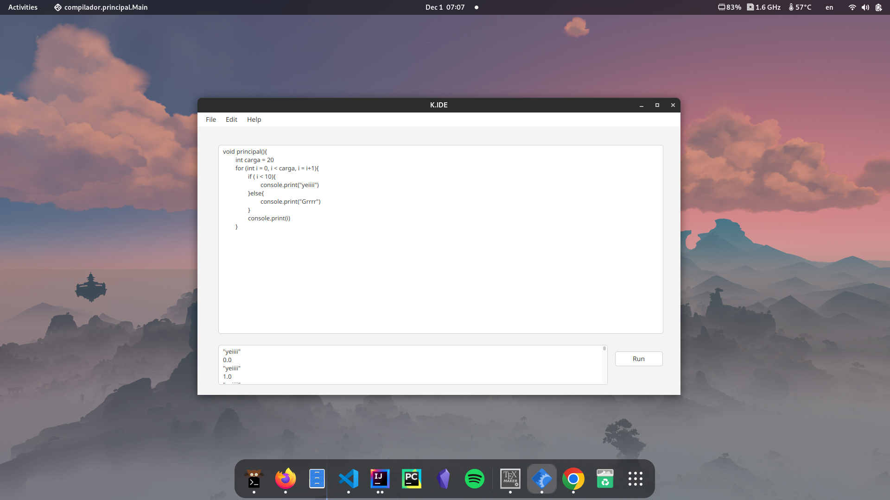

# Kiwi / K.IDE
## Overview
 Entorno de desarrollo que incluye compilador y transpilador para Lenguajes y Autómatas II. Escrito en Java, ANTLR4, Python y un poco de CSS. 
Inspirado en el estilo de Python y ciertas referencias a JavaScript



### Dependencias
- Python 3.11
- Java 19
- JavaFX
- Kitty terminal
- NeoVim
- IntelliJ Idea* (para el build, es posible utilizar otras herramientas o hacerlo a mano)

### Instalación

```bash
git clone https://github.com/jorgerf05/K.IDE.git
cd K.IDE
idea .
```
## --- Documentación ---

### Gramática de lenguaje

```java

grammar Compilador;

compilador: cuerpo;

cuerpo: ENDL* VOID PRINCIPAL '(' args ')' '{' ENDL*contenido* fin;
fin:'}';
args: ARG*;

contenido:
assign ENDL*
|declaration ENDL*
|impresion ENDL*
|if ENDL*
|for ENDL*
;

if: IF '('condicion')' '{'ENDL* contenido*ENDL*'}' ENDL* else?;

condicion:
   expr op =(MAYOR|MAYORIGUAL|MENOR|MENORIGUAL|IGUALQUE|DIFERENTEDE) expr
   |condicion opLog=(OR|AND) condicion | '('condicion')' opLog=(OR|AND) '('condicion')'
   |BOOL
   ;

else: ELSE ('{' ENDL* contenido* ENDL* '}'|if);

for: FOR '('declaration', ' condicion', 'assign')''{'ENDL* contenido* ENDL*'}';

declaration:  TYPE ID (EQUALS expr)?;

assign: ID EQUALS expr #assignment;

impresion: PRINT '('expr')'|PRINT'('STRING')';

expr:
  expr POTENCIA expr #potencia
| expr op=(POR|ENTRE) expr #multiplicacion_o_division
| expr op=(MAS|MENOS) expr #suma_o_resta
| '('expr')' #pare
| NUM #numero
| ID #variable
;

VOID: 'void';
PRINCIPAL: 'principal';
NUM: [0-9]+(.[0-9]+)*;
POTENCIA:'^';
MAS: '+';
POR: '*';
MENOS: '-';
ENTRE:'/';
EQUALS: '=';
FOR:'for';
OR:'or';
AND:'and';
BOOL:'true'|'false';
IF: 'if';
ELSE:'else';
TYPE:'int'|'float';
MAYOR: '>';
MAYORIGUAL:'>=';
MENOR: '<';
MENORIGUAL:'<=';
DIFERENTEDE:'!=';
IGUALQUE:'==';
PRINT:'console.print';
ID: [a-zA-Z0-9_]+;
STRING:'"'[a-zA-Z. ]+'"';
ARG: [a-zA-Z0-9]+;
ENDL:[\n];
IGNORE: [ \t\r] ->skip;

```

### Interfaz gráfica con declaración, asignación e impresión
La interfaz gráfica fue creada usando JavaFX en conjunto con SceneBuilder. Adem´as, se opt´o por usar un
Stylesheet de CSS para darle un estilo sencillo pero elegante al entorno de desarrollo. La interfaz es invocada desde
la clase Main de la siguiente manera:

```java
public class Main extends Application {
    public void start(Stage primaryStage) throws Exception {
        Parent root = FXMLLoader.load(Objects.requireNonNull(getClass().getResource("IDE.fxml")));
        Scene scene = new Scene(root);
        String css_theme = Objects.requireNonNull(this.getClass().getResource("bootstrap3.css")).toExternalForm();
        scene.getStylesheets().add(css_theme);
        primaryStage.setScene(scene);
        primaryStage.setTitle("IDE");
        primaryStage.show();
    }
    public static void main(String[] args) {
        launch(args);
    }
}
```

### Elaboración del cascarón
La forma general de un programa escrita en Kiwi tiene la siguiente forma
```c
void principal(){
}
```

Para la parte de declaración se debe proporcionar un tipo de dato y un nombre para la variable. Es decir:
```c
int a
double b
```

La estructura está definida en la gramática. La varible declarada se almacenará en un HashMap y se revisará que no exista ya.

```java
@Override
    public Object visitDeclaration(CompiladorParser.DeclarationContext ctx) {
        String id = ctx.ID().toString();
        Object obj = visit(ctx.expr());

        double dummy = (double) obj;
        int entero_jasmin = (int) dummy;

        if (!mem.get(level).containsKey(id)){
            if (ctx.EQUALS() != null) { //Si hay asignacion
                writeJasmin("ldc "+entero_jasmin+"\nistore "+mem.get(level).size()+"\n");
                mem.get(level).put(id, obj);
                translation.add(ctx.TYPE().toString() + " " + id + " = " + obj + ";");
            } else { //Si no hay asignacion
                mem.get(level).put(id, null);
                translation.add(ctx.TYPE().toString() + " " + id + ";");
            }
        } else {
            //Controller.static_lbl.setText("La variable " + id + " ya existe!");
            Controller.static_salida.appendText("La variable " + id + " ya existe!");
            System.out.println("La variable " + id + " ya existe!");
        }
        return visitChildren(ctx);
    }

```

Para asignar un valor a una variable seguimos la siguiente sintaxis
```c
Variable = valor
b = 1.2
```

Dichas asignciones son controladas de la siguiente manera
```java
@Override
    public Object visitAssignment(CompiladorParser.AssignmentContext ctx) {

        String id = ctx.ID().toString();
        Object obj = visit(ctx.expr());

        double dummy = (double) obj;
        int entero_jasmin = (int) dummy;

        if (!mem.get(level).containsKey(id)) {
            writeJasmin("ldc "+entero_jasmin+"\nistore "+mem.get(level).size()+"\n");
            mem.get(level).put(id, obj);
        } else {
            mem.get(level).replace(id, obj);
        }
        translation.add(id + " = " + obj + ";");
        return null;
    }

```

### Potencias
En el lenguaje es posible evaluar potencias utilizando el operador circunflejo
```java
a = 2^2
```
Dicha operación es manejada por el backend de la siguiente forma:
```java
@Override
    public Object visitPotencia(CompiladorParser.PotenciaContext ctx) {

        double a = (double) visit(ctx.expr(0));
        double b = (double) visit(ctx.expr(1));

        return Math.pow(a, b);
    }
```

### Traducción desde C
Para realizar esta traducción se optó por utilizar expresiones regulares. Esta traducción toma el texto dentro de la caja de código y lo reemplaza por su traducción. Funciona de la siguiente manera:
```java
 public void translateFromC(String in){ //reemplazamos con expresiones regulares


        in = in.replaceAll("(i\\+\\+)","i = i+1");
        in = in.replaceAll("(#include <[a-zA-Z.]+>)", "");
        in = in.replaceAll("main", "principal");
        in = in.replaceAll(",", "");
        in = in.replaceAll(";", "");
        in = in.replaceAll("&&","and");
        in = in.replaceAll("(\\/[a-zA-Z0-9 ]*)","");
        in = in.replaceAll("printf", "console.print");
        in = in.replaceAll("(%.)", "");

        System.out.println(in);
        txt_codigo.setText(in);
    }

```

### Traducción de Kiwi-lang a C
La traducción de mi lenguaje a C es algo un poco más manual. Consiste en ir añadiendo a una lista cada instrucción, línea por línea de forma manual. Dichas instrucciones se añaden durante las visitas, por lo que tendremos disponible la traducción a C en todo momento. Debajo un ejemplo de una adición a la traducción. El ejemplo es tomado de las impresiones.
```java
out = String.valueOf(this.visit(ctx.expr()));
            String variable = ctx.expr().getText();
            System.out.println(out);
            Controller.static_lbl.setText(out);
            translation.add("printf(\"%i\"," + variable + ");");
```


### Condicional If-Else
Esta parte comprende la implementación de la lógica de condiciones if, if else y sus variantes. Primero, veamos la parte más importante; resolver la condición dentro del if. Tenemos tres posibles casos: 1 - Resolver expresiones, 2 - Resolver comparaciones y 3 - Que se nos presenten booleanos literales. Estos 3 escenarios para la condición son manejados de la siguiente manera:
```java
@Override
    public Object visitCondicion(CompiladorParser.CondicionContext ctx) {
        boolean bool, bool2;

        if(ctx.opLog!=null) { //si tenemos AND o OR
            switch (ctx.opLog.getText()) {
                case "and" -> {
                    bool = (boolean) visit(ctx.condicion(0));
                    bool2 = (boolean) visit(ctx.condicion(1));
                    if (bool && bool2) {
                        return true;
                    }
                }
                case "or" -> {
                    bool = (boolean) visit(ctx.condicion(0));
                    bool2 = (boolean) visit(ctx.condicion(1));
                    if (bool || bool2) {
                        return true;
                    }
                }
                default -> {
                    Controller.static_lbl.setText("Operador invalido");
                    System.out.println("Operador logico no valido");
                }
            }
        }
        else if (ctx.BOOL() != null) { //si presentamos booleanos literales
            bool = Boolean.parseBoolean(ctx.BOOL().getText());
            return bool;

        } else{ //si hay que resolver con logica numerica
            String operator = ctx.op.getText();
            double a = (double) visit(ctx.expr(0));
            double b = (double) visit(ctx.expr(1));

            bool = switch (operator) {
                case ">" -> a > b;
                case ">=" -> a >= b;
                case "<" -> a < b;
                case "<=" -> a <= b;
                case "!=" -> a != b;
                case "==" -> a == b;
                default -> false;
            };
            return bool;
        }
        return false;
    }
```

Ahora definimos la manera para visitar la estructura de la condición. Una visita muy sencilla con un método que veremos más adelante, en la sección del scope de variables.
```java
@Override
    public Object visitIf(CompiladorParser.IfContext ctx) {

        boolean key = (boolean) visit(ctx.condicion()); //resolvemos la logica de la condicion

        if (key) {//si se cumple la condicion
            changeLevel("up");
            for (int i = 0; i < ctx.children.size() - 1; i++) {//visitamos a los hijos, menos al ultimo (porque es else)
                visit(ctx.children.get(i));
            }

        } else {//si no, visitamos el else, que es el ultimo hijo de la estructura if
                //si no hay else, esto simplemente visitara un newline y no hara nada
            changeLevel("up");
            visit(ctx.children.get(ctx.children.size() - 1));
        }
        changeLevel("down");
        return null;
    }
```

### Ciclo For
La implementación del ciclo for consiste en simplemente realizar la declaración - asignación del ciclo, resolver la expresión e iterar visitando a los nodos hijos de la estructura gramática. Implementado de la siguiente forma:
```java
@Override
    public Object visitFor(CompiladorParser.ForContext ctx) {

        visit(ctx.declaration()); //primero validamos la declaracion
        boolean cond = (boolean) visit(ctx.condicion()); //resolvemos la condicion

        if (cond) {//si se cumple la condicion de buenas a primeras
            changeLevel("up");
            while (true) {
                for (int j = 0; j < ctx.contenido().size(); j++) {//ciclo para visitar los hijos
                    visit(ctx.contenido(j));
                }
                visit(ctx.assign()); //i = i+1
                if (!(boolean) visit(ctx.condicion())) { //si la condicion es falsa, hemos llegado al tope.
                    changeLevel("down");
                    return null;
                }
            }
        }
        return null;
    }
```
La sintaxis de un ciclo for en mi lenguaje es la siguiente (no se admite el operador ++):
```c
for (int i = 1, i < 10, i=i+1){	
	console.print(i)
}
```


### Scope de variables
Como sabemos, los lenguajes de programación suelen contar con un control de variables por "niveles". Es decir, si declaramos una variable dentro de un condicional if no podremos acceder a esa variable fuera del condicional. Esto es lo que llamamos el scope de variables. Para implementarlo, utilizamos una copia de la memoria principal del programa (o memoria temporal), donde se copian las variables del scope principal y se añaden la nuevas. Una vez se salga de el condicional, esta nueva memoria se destruye. El scope fue implementado manualmente de la siguiente manera:

```java
void changeLevel(String str) {
        switch (str) {
            case "up" -> {
                level++; //subimos el nivel
                LinkedHashMap<String, Object> tmp = new LinkedHashMap<>(mem.get(level - 1)); //hacemos una copia temporal del nivel abajo
                mem.set(level, tmp);//copiamos el contenido de tmp al nivel actual
            }
            case "down" -> {
                LinkedHashMap<String, Object> memtest = new LinkedHashMap<>();//Mapa vacío
                mem.set(level, memtest); //Vaciamos el nivel
                level--; //bajamos de nivel
            }
        }
    }

```

### Construcción y compilación de codígo Jasmin / JVM
La construcción de código Jasmin se realiza de la misma manera que se traduce de Kiwi a C, con la adición de una capa de control de variables que permita
al analizador semántico generar código que sea capaz de referenciar variables con su dirección de memoria. Es por esto que utilizamos LinkedHashMap en lugar de un HashMap estándar (recordemos que este último no asegura la integridad del orden los elementos dentro de él.)

Tomemos el ejemplo de la traducción de una sentencia print. Observemos la llamada al método findJasmin. Este método relaciona nombres de variables con su posición en la pila de la JVM.
```java
@Override
    public Object visitImpresion(CompiladorParser.ImpresionContext ctx) {
        String out;
        if (ctx.STRING() != null) {//si hay un string literal
            out = ctx.STRING().toString();
            System.out.println(out);
            Controller.static_salida.appendText(out+"\n");
            writeJasmin("\ngetstatic java/lang/System/out Ljava/io/PrintStream;");
            writeJasmin("\nldc "+out);
            writeJasmin("\ninvokevirtual java/io/PrintStream/println(Ljava/lang/String;)V\n");
        } else { //si hay variable

            double out_real = (double)visit(ctx.expr());
            out = String.valueOf(out_real);
            String variable = ctx.expr().getText();

            System.out.println(out);
            Controller.static_salida.appendText(out+"\n");

            translation.add("printf(\"%i\"," + variable + ");");
            writeJasmin("\ngetstatic java/lang/System/out Ljava/io/PrintStream;\n");
            findJasmin(ctx.expr().getText());
            writeJasmin("\ninvokevirtual java/io/PrintStream/println(I)V\n");
        }

        return null;

    }

```

El método findJasmin se encarga de encontrar la posición en la pila de la JVM de una variable en base a su nombre dentro de Kiwi. Recibe este dato como una cadena. Además, muestra en consola datos relevantes para el debugging.
```java
 void findJasmin(String id){
        if (is_translating){
            System.out.println("Buscando variable... "+id);
            List<String> keys = new ArrayList<>(mem.get(level).keySet());

            System.out.println("-------VARIABLES EN MEMORIA-------");
            int i = 0;
            for (String str:keys
            ) {
                System.out.println(i + " -> "+str);
                i++;

            }
            System.out.println("----------------------------------");

            i = 0;
            boolean found = false;
            try {
                do {
                    if (Objects.equals(keys.get(i), id)) { //si encontramos el nombre

                        System.out.print("VARIABLE ENCONTRADA: ");
                        System.out.println("pos -> "+i+" var -> "+keys.get(i));
                        writeJasmin("\niload " + i+"\n"); //cargamos la variable i
                        found = true;
                    }
                    i++;
                }while (!found);
            }catch (Exception e){
                System.out.println("No se encontró");
            }
        }
    }

```

### Compilación y ejecución
El método principal para realizar el proceso de compilación y ejecución es writeToTxt. Este método es invocado al hacer clic en el botón "Compilar" dentro de K.IDE. Escribe un archivo de texto con el código de Jasmin y posteriormente invoca un subproceso de Python para la compilación desde el archivo de texto y ejecución. 
```java
    @FXML
    public void writeToTxt() {
        MyVisitor.jasmin.clear();
        MyVisitor.is_translating = true;
        run(); //Llenamos la lista de traduccion.
        MyVisitor.is_translating = false;
        try{
            FileWriter myWriter = new FileWriter("Principal.j");
            for (String str: MyVisitor.jasmin
            ) {
                myWriter.write(str);
            }
            myWriter.close();

            ArrayList<String> commands = new ArrayList<>();
            commands.add("python");
            commands.add("Main.py");
            Caller caller = new Caller(commands);
            caller.execute();
        }catch (IOException ex){
            System.out.println("error "+ex);
        }


    }
```

El objeto Caller es sumamente sencillo. Recibe una lista de argumentos y los ejecuta como un subproceso. Es algo limitado en cuanto a manejo de tiempos, por lo que lo utilizamos de puente a un script Python
```java
public class Caller {
    private List<String> commands = new ArrayList<>();
    public Caller(List <String> commands) {
        this.commands = commands;
    }
    public void execute() throws IOException {
        ProcessBuilder process = new ProcessBuilder(this.commands);
        process.directory(new File("/home/jorge/IdeaProjects/Compilador/"));
        process.start();
    }
}
```
Y el script de Python (necesario para esperar a que se finalicen los procesos)
```python
import os

os.system("java -jar /usr/local/lib/jasmin.jar Principal.j")
os.system("java principal > out.txt")
os.system("kitty nvim out.txt")
```

Y esto mostrará una ventana con la salida de nuestro ejecutable.
